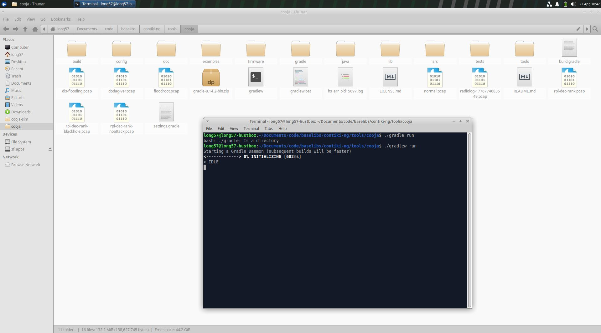
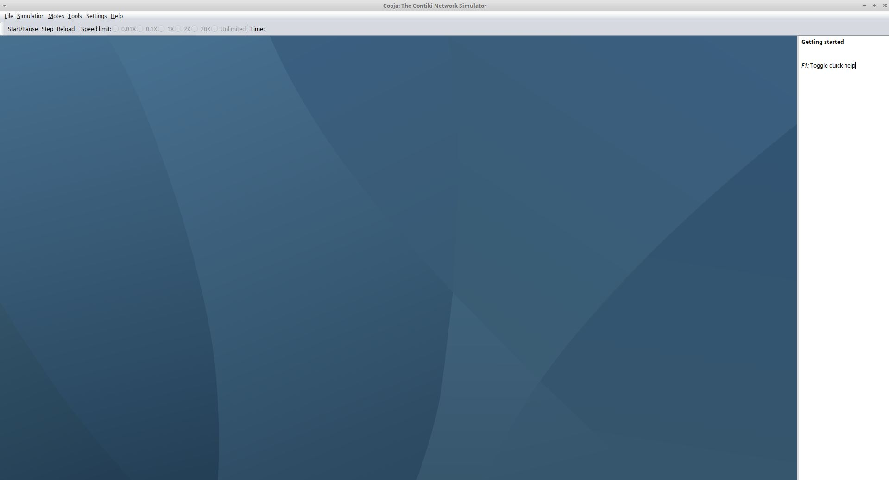
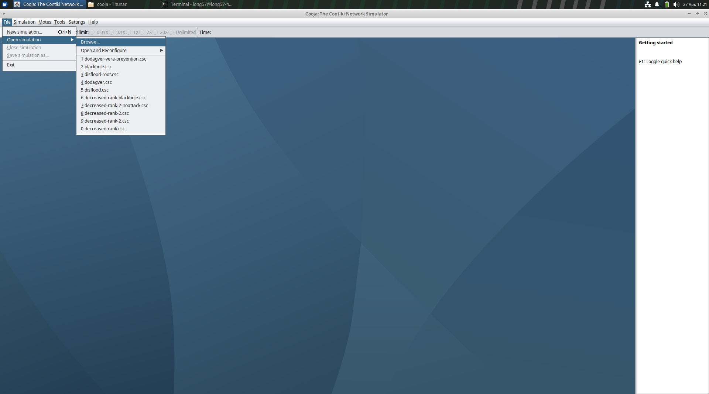
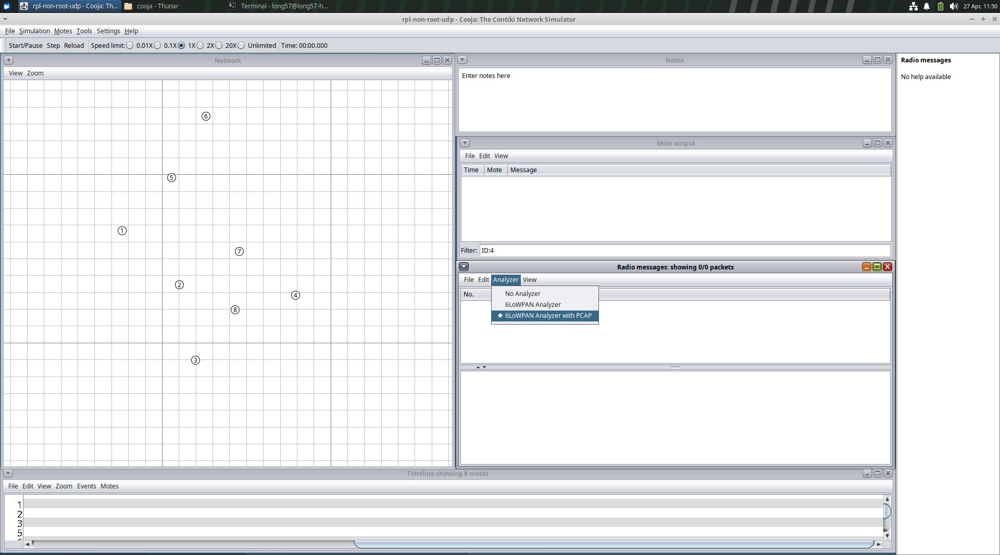
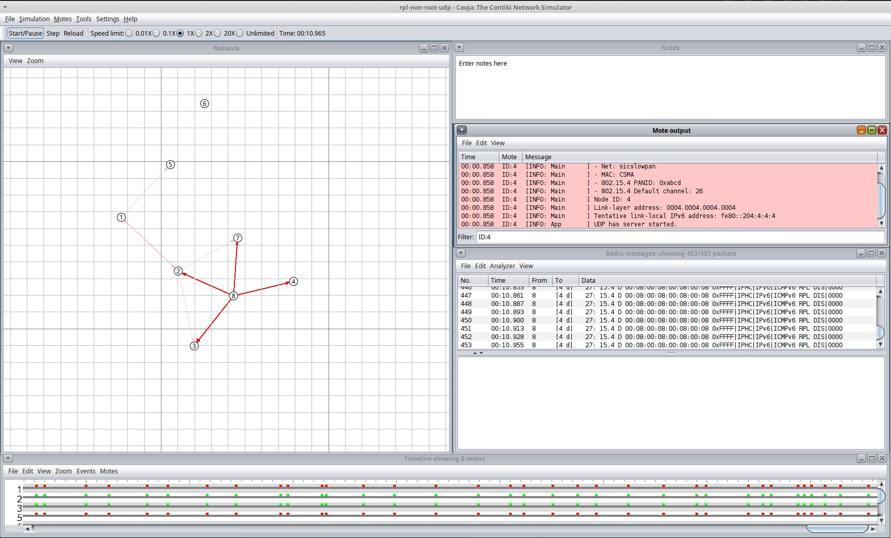

# RPL-UDP-ATTACKS

Repo này chứa các ví dụ về tấn công RPL bằng cách sử dụng UDP, cùng với các biện pháp phòng chống. 

## Các loại tấn công RPL được triển khai trong repo này:

- DIS Flooding Attack (Phân loại: Tấn công tài nguyên): Tấn công này làm ngập mạng với các gói DIS, khiến các nút phải liên tục cập nhật bảng định tuyến, dẫn đến tiêu tốn tài nguyên, năng lượng và giảm hiệu suất truyền tin.

- DAG Version Attack (Phân loại: Tấn công tài nguyên): Tấn công này liên tục làm tăng phiên bản DAG một cách giả mạo, khiến các nút phải liên tục cập nhật bảng định tuyến và tiêu tốn tài nguyên.

- Rank Decrease Attack (Phân loại: Tấn công traffic): Tấn công này làm hạ rank của một nút, hút traffic về nút đó. Thường khiến đường đi dữ liệu không tối ưu và có thể tạo vòng lặp, làm giảm hiệu suất truyền tin và tiêu tốn năng lượng. Rank attack cũng có thể được sử dụng để phục vụ cho việc nghe lén hoặc tấn công blackhole (sẽ nêu ở ngay dưới).

- Blackhole Attack (Phân loại: Tấn công topo/hình trạng mạng): Tấn công này làm cho một nút trở thành "hố đen" (nhận tất cả traffic nhưng không chuyển tiếp đi đâu). Tấn công này có thể cô lập các nút kết nối trực tiếp đến nó, làm mất dữ liệu và gấy gián đoạn dịch vụ.

## Các biện pháp phòng chống tương ứng được triển khai trong repo này:

- Với DIS Flooding Attack: Tính tỉ lệ (DIS + 1) / (Tổng số gói + 2) theo chu kỳ và so sánh với ngưỡng để xác định xem có đang bị tấn công hay không. Nếu tỉ lệ vượt quá ngưỡng, nút sẽ bỏ qua các gói DIS tiếp theo đến khi tỉ lệ giảm xuống dưới ngưỡng hoặc qua chu kỳ tiếp theo.
    - Trạng thái: Đã triển khai.

- Với DAG Version Attack: (Cân nhắc) Sử dụng phiên bản giản lược từ VeRA (\[Ve\]rsion and \[R\]nk \[A\]uthentication). 
    - Version mới phải hash ra được thành phiên bản bản hiện tại để được xem là hợp lệ. 
    - Không hash rank để đơn giản hoá.
    - Nút gửi sẽ phải là preferred parent của nút nhận để được xem là hợp lệ. Nếu preferred parent gửi phiên bản không hợp lệ, sẽ bị xoá khỏi các neighbor và đưa vào blacklist trong 1 phút. 
    - Với nút root, mọi yêu cầu cập nhật phiên bản không hợp lệ sẽ bị bỏ qua và đưa vào blacklist.
    - Trạng thái: Đã triển khai.

- Với Rank Decrease Attack: N/A
    - Trạng thái: Chưa có ý tưởng.

- Với Blackhole Attack: Gửi gói tin kiểm tra, nếu không phản hồi sau một khoảng thời gian nhất định, đánh dấu nút đó là khả nghi. Tiếp tục gửi các nút xung quanh để kiểm tra, nếu các nút xung quanh trả về kết quả là nghi ngờ, đánh dấu nút đó là blackhole và bỏ qua các gói tin đến từ nó.
    - Trạng thái: Ý tưởng khả thi. Chưa thực hiện.

## Cấu trúc thư mục:

### Các thư mục chứa mã nguồn tấn công:
- no-rank-attack: Chứa mã nguồn cho các nút không được lập trình để tấn công rank, bao gồm các nút bình thường (root, server, client) và các nút tấn công khác (DIS flooding, DAG version).
- rank-attack: Chứa mã nguồn cho các nút được lập trình để tấn công rank. Cần tách riêng do sử dụng thử viện RPL được chỉnh sửa.

## Các thư mục chứa mã nguồn phòng chống:
- prevent-dis: Chứa mã nguồn cho các nút được lập trình để phòng chống DIS flooding attack.
- prevent-dagver: Chứa mã nguồn cho các nút được lập trình để phòng chống DAG version attack.
- prevent-rank: Chứa mã nguồn cho các nút được lập trình để phòng chống rank decrease attack. (Hiện chưa có)
- prevent-blackhole: Chứa mã nguồn cho các nút được lập trình để phòng chống blackhole attack.

## Cách sử dụng repo này và triển khai các kịch bản tấn công/phòng chống:
### Chuẩn bị môi trường:
Cần một máy tính chạy Linux (máy thật, máy ảo, WSL đều được). Để tham khảo, tác giả sử dụng Xubuntu 24.04.

### Tải repo Contiki-NG:

1. Kéo repo Contiki-NG về máy từ repo chính thức bằng lệnh:

```bash
git clone https://github.com/contiki-ng/contiki-ng.git
```

### Cài đặt toolchain:

1. Cài đặt các gói cần thiết để biên dịch Contiki-NG:

```bash
sudo apt update
sudo apt install build-essential doxygen git git-lfs curl wireshark python3-serial srecord rlwrap
```

2. Cài đặt Java (để sử dụng Cooja):

```bash
sudo apt install default-jdk ant
update-alternatives --config java
```

Có thể thay `default-jdk` bằng phiên bản JDK thích hợp. `openjdk-17-jdk` đã được thử nghiệm và hoạt động tốt.

Trong trường hợp muốn sử dụng docker, có thể thực hiện các bước sau:
1. Cài đặt docker:

```bash
sudo apt-get install docker-ce docker-ce-cli containerd.io docker-buildx-plugin docker-compose-plugin
```

Sau khi cài, để tiện thực thi lệnh docker không cần quền sudo, có thể thêm người dùng của bạn vào nhóm docker:

```bash
sudo usermod -aG docker $USER
```

Để áp dụng thay đổi nhóm, bạn cần đăng xuất và đăng nhập lại hoặc khởi động lại máy.

2. Kéo image đã được build sẵn từ Docker Hub:

```bash
docker pull contiker/contiki-ng
```

3. Tạo alias để tiện gọi lệnh docker triển khai container:

    Thêm đoạn sau vào file `~/.bashrc`:

```bash
export CNG_PATH=<absolute-path-to-your-contiki-ng>
alias contiker="docker run --privileged --sysctl net.ipv6.conf.all.disable_ipv6=0 --mount type=bind,source=$CNG_PATH,destination=/home/user/contiki-ng -e DISPLAY=$DISPLAY -e LOCAL_UID=$(id -u $USER) -e LOCAL_GID=$(id -g $USER) -v /tmp/.X11-unix:/tmp/.X11-unix -v /dev/bus/usb:/dev/bus/usb -ti contiker/contiki-ng"
```

4. Tạo và nhảy vào container mới:

```bash
contiker
```

### Tải repo này về:
1. Clone repo này về máy:

```bash
git clone https://github.com/long-in-hust/rpl-udp-attacks.git
```

Tác giả khuyến khích clone repo về thư mục examples của Contiki-NG để tiện chỉnh sửa Makefile sau này, nhưng bạn có thể clone ở bất kỳ đâu.

2. Mở các thư mục con tưởng ứng, mở Makefile và sửa giá trị CONTIKI để trỏ đến thư mục Contiki-NG trên máy của bạn. Nếu đã clone vào thư mục examples của Contiki-NG, bạn có thể để nguyên giá trị này.

Ví dụ makefile:

```makefile
CONTIKI_PROJECT = udp-client udp-root udp-server
all: $(CONTIKI_PROJECT)

CONTIKI=../../..
MODULES += net/routing/rpl-lite
MODULES_REL += ./custom-lib

include $(CONTIKI)/Makefile.include
```

### Biên dịch mã nguồn thành chương trình thực thi:
1. Mở terminal, điều hướng đến thư mục chứa mã nguồn của kịch bản bạn muốn chạy, ví dụ:

```bash
cd rpl-udp-attacks/no-rank-attack
```

2. Biên dịch mã nguồn bằng lệnh:

```bash
make TARGET=cooja
```
Lệnh này sẽ biên dịch mã nguồn và tạo ra các file thực thi (.cooja) trong thư mục `build/cooja`. Các file này có thể được sử dụng để chạy mô phỏng trong Cooja.

### Chạy mô phỏng trong Cooja:

1. Trên giao diện desktop của Linux, vào thư mục repo Contiki-NG. Từ đây, chuyển vào thư mục `tools/cooja`.

2. Mở terminal và chạy Cooja:

```bash
./gradlew run
```





3. Mở file csc mô phỏng lại mô hình mạng:

    1. Trên giao diện Cooja, chọn `File -> Open simulation...`

    

    2. Tìm đến thư mục của repo này, vào thư mục `simulations` và chọn file csc tương ứng với kịch bản bạn muốn chạy. Ví dụ, để chạy kịch bản tấn công DIS flooding, chọn file `dis-flooding.csc`.

4. Bạn sẽ thấy giao diện như hình dưới, sơ đồ mạng ở khung **Network**, log ở khung **Mote output**. Các gói tin được hiển thị ở khung **Radio messages**.



5. Nhấn **Start/Pause** để bắt đầu mô phỏng hoặc tạm dừng mô phỏng. Bạn sẽ thấy các gói tin được gửi đi và log được in ra ở khung Mote output.




6. Nút **Step** sẽ cho phép bạn chạy mô phỏng từng bước một, còn **Reload** sẽ khởi động build lại mã và khởi động lại mô phỏng.

## Cấu trúc file csc:
File csc là file cấu hình cho mô phỏng trong Cooja, định nghĩa các tham số của mô phỏng như số lượng nút, loại nút, vị trí nút, kịch bản tấn công, v.v. Mỗi file csc tương ứng với một kịch bản tấn công hoặc phòng chống cụ thể. Csc có cấu trúc dạng XML, với các thẻ định nghĩa các tham số của mô phỏng. Dưới đây là một ví dụ về cấu trúc file csc (dựa trên file `dis-flooding.csc`):

```xml
<?xml version="1.0" encoding="UTF-8"?>
<!--
  File cấu hình mô phỏng Cooja.
  Định dạng gốc: .csc (thực chất là XML).
-->
<simconf version="2023090101">

  <simulation>
    <!-- Tên mô phỏng hiển thị trong Cooja -->
    <title>ten-mo-phong</title>

    <!-- Tốc độ chạy mô phỏng (1.0 = realtime, >1 chạy nhanh hơn) -->
    <speedlimit>2.0</speedlimit>

    <!-- Seed random để tái lập kết quả -->
    <randomseed>123456</randomseed>

    <!-- Độ trễ khởi động giữa các mote (micro giây) -->
    <motedelay_us>1000000</motedelay_us>

    <!-- Mô hình radio -->
    <radiomedium>
      org.contikios.cooja.radiomediums.UDGM
      <transmitting_range>50.0</transmitting_range>
      <interference_range>100.0</interference_range>
      <success_ratio_tx>1.0</success_ratio_tx>
      <success_ratio_rx>1.0</success_ratio_rx>
    </radiomedium>

    <!-- Thiết lập sự kiện/log -->
    <events>
      <logoutput>50000</logoutput>
    </events>

    <!--
      Một motetype = một loại node:
      - source: file C nguồn
      - commands: lệnh build firmware .cooja
      - moteinterface: các interface phần cứng/logic trong Cooja
      - mote: các instance node thuộc loại này
    -->
    <motetype>
      org.contikios.cooja.contikimote.ContikiMoteType
      <description>Root Mote</description>
      <source>[CONFIG_DIR]/../path/udp-root.c</source>
      <commands>$(MAKE) -j$(CPUS) udp-root.cooja TARGET=cooja</commands>

      <!-- Danh sách interface thường dùng -->
      <moteinterface>org.contikios.cooja.interfaces.Position</moteinterface>
      <moteinterface>org.contikios.cooja.contikimote.interfaces.ContikiMoteID</moteinterface>
      <moteinterface>org.contikios.cooja.interfaces.IPAddress</moteinterface>
      <moteinterface>org.contikios.cooja.contikimote.interfaces.ContikiRadio</moteinterface>
      <moteinterface>org.contikios.cooja.contikimote.interfaces.ContikiLED</moteinterface>

      <!-- Instance mote cụ thể -->
      <mote>
        <interface_config>
          org.contikios.cooja.interfaces.Position
          <pos x="0.0" y="0.0" />
        </interface_config>
        <interface_config>
          org.contikios.cooja.contikimote.interfaces.ContikiMoteID
          <id>1</id>
        </interface_config>
      </mote>
    </motetype>

    <!-- Ví dụ motetype cho client -->
    <motetype>
      org.contikios.cooja.contikimote.ContikiMoteType
      <description>Client Mote</description>
      <source>[CONFIG_DIR]/../path/udp-client.c</source>
      <commands>$(MAKE) -j$(CPUS) udp-client.cooja TARGET=cooja</commands>
      <moteinterface>org.contikios.cooja.interfaces.Position</moteinterface>
      <moteinterface>org.contikios.cooja.contikimote.interfaces.ContikiMoteID</moteinterface>

      <mote>
        <interface_config>
          org.contikios.cooja.interfaces.Position
          <pos x="20.0" y="20.0" />
        </interface_config>
        <interface_config>
          org.contikios.cooja.contikimote.interfaces.ContikiMoteID
          <id>2</id>
        </interface_config>
      </mote>

      <mote>
        <interface_config>
          org.contikios.cooja.interfaces.Position
          <pos x="35.0" y="25.0" />
        </interface_config>
        <interface_config>
          org.contikios.cooja.contikimote.interfaces.ContikiMoteID
          <id>3</id>
        </interface_config>
      </mote>
    </motetype>

    <!-- Ví dụ motetype cho server -->
    <motetype>
      org.contikios.cooja.contikimote.ContikiMoteType
      <description>Server Mote</description>
      <source>[CONFIG_DIR]/../path/udp-server.c</source>
      <commands>$(MAKE) -j$(CPUS) udp-server.cooja TARGET=cooja</commands>
      <moteinterface>org.contikios.cooja.interfaces.Position</moteinterface>
      <moteinterface>org.contikios.cooja.contikimote.interfaces.ContikiMoteID</moteinterface>

      <mote>
        <interface_config>
          org.contikios.cooja.interfaces.Position
          <pos x="60.0" y="30.0" />
        </interface_config>
        <interface_config>
          org.contikios.cooja.contikimote.interfaces.ContikiMoteID
          <id>4</id>
        </interface_config>
      </mote>
    </motetype>

  </simulation>

  <!-- Plugin giao diện: Visualizer -->
  <plugin>
    org.contikios.cooja.plugins.Visualizer
    <plugin_config>
      <moterelations>true</moterelations>
      <skin>org.contikios.cooja.plugins.skins.IDVisualizerSkin</skin>
      <skin>org.contikios.cooja.plugins.skins.GridVisualizerSkin</skin>
      <skin>org.contikios.cooja.plugins.skins.TrafficVisualizerSkin</skin>
      <skin>org.contikios.cooja.plugins.skins.UDGMVisualizerSkin</skin>
      <viewport>2.0 0.0 0.0 2.0 300.0 150.0</viewport>
    </plugin_config>
    <bounds x="1" y="1" width="900" height="700" />
  </plugin>

  <!-- Plugin log text -->
  <plugin>
    org.contikios.cooja.plugins.LogListener
    <plugin_config>
      <!-- Có thể lọc theo ID node -->
      <filter>ID:2</filter>
      <formatted_time />
      <coloring />
    </plugin_config>
    <bounds x="910" y="1" width="800" height="250" />
  </plugin>

  <!-- Plugin timeline radio/LED -->
  <plugin>
    org.contikios.cooja.plugins.TimeLine
    <plugin_config>
      <!-- Mỗi số là index mote theo thứ tự tạo -->
      <mote>0</mote>
      <mote>1</mote>
      <mote>2</mote>
      <showRadioRXTX />
      <showRadioHW />
      <showLEDs />
      <zoomfactor>500.0</zoomfactor>
    </plugin_config>
    <bounds x="1" y="710" width="1700" height="220" />
  </plugin>

  <!-- Plugin ghi chú -->
  <plugin>
    org.contikios.cooja.plugins.Notes
    <plugin_config>
      <notes>Ghi chu mo phong tai day</notes>
      <decorations>true</decorations>
    </plugin_config>
    <bounds x="910" y="260" width="800" height="140" />
  </plugin>

  <!-- Plugin bắt packet/radio -->
  <plugin>
    org.contikios.cooja.plugins.RadioLogger
    <plugin_config>
      <split>150</split>
      <formatted_time />
      <analyzers name="6lowpan-pcap" />
    </plugin_config>
    <bounds x="910" y="410" width="800" height="520" />
  </plugin>

</simconf>
```